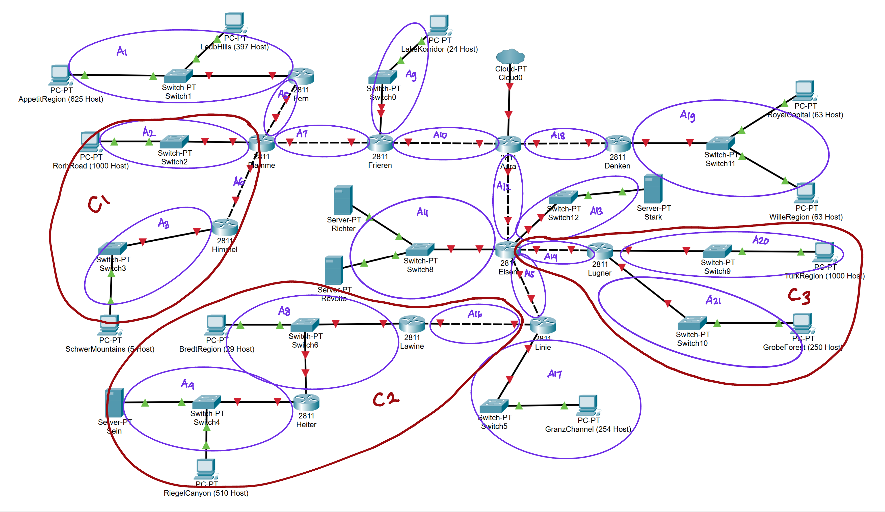

# Jarkom-Modul-4-B03-2023
Berikut adalah laporan resmi untuk praktikum modul 4 jarkom.

| Nama | NRP |
|---------------------------|------------|
|Wan Sabrina Mayzura | 5025211023 |
|Syarifah Talitha Erfany | 5025211175 |

## Daftar Isi
  - [Topologi PKT CIDR](#topologi-pkt-cidr)
  - [Topologi GNS VLSM](#topologi-gns-vlsm)
  - [Rute](#rute)
- [VLSM](#vlsm)
  - [Tree](#tree)
  - [Pembagian IP](#pembagian-ip)
  - [Config GNS3](#config-gns3)
  - [Routing](#routing)
  - [Testing](#testing)
- [CIDR](#cidr)
  - [Penggabungan IP](#penggabungan-ip)
  - [Tree](#tree-1)
  - [Pembagian IP](#pembagian-ip-1)
  - [Routing](#routing-1)
  - [Testing](#testing-1)

## Topologi GNS VLSM 

## Topologi Cisco Packet Tracer CIDR


## Rute

### VLSM

### CIDR





## VLSM
### Tree
### Pembagian IP
### Config GNS3
### Routing
### Testing

## CIDR
### Tree
Berikut adalah pembagian tree CIDR. IP didapatkan dari perhitungan melalui [Visual Subnet Calculator](https://www.davidc.net/sites/default/subnets/subnets.html)


### Pembagian IP
Dari IP yang telah diketahui sebelumnya, dimasukkan kedalam file excel agar lebih teratur.


### Penggabungan
Penggabungan yang sebelumnya telah berhasil akan dicatat di excel serta netmask tiap subnet yang ada.


.png)

### Config Cisco Packet Tracer

- A1
  - Fern (Router)
    ```
    IPv4 Address  : 10.8.24.1
    Subnet Mask   : 255.255.248.0
    ```

  - AppetitRegion (Client)
    ```
    IPv4 Address  : 10.8.24.2
    Subnet Mask   : 255.255.248.0
    ```

  - LaubHills (Client)
    ```
    IPv4 Address  : 10.8.24.3
    Subnet Mask   : 255.255.248.0
    ```

- A2
  - Flamme (Router)
    ```
    IPv4 Address  : 10.8.12.1
    Subnet Mask   : 255.255.252.0
    ```

  - RorhRoad (Client)
    ```
    IPv4 Address  : 10.8.12.2
    Subnet Mask   : 255.255.252.0
    ```

- A3
  - Himmel (Router)
    ```
    IPv4 Address  : 10.8.0.2
    Subnet Mask   : 255.255.255.248
    ```

  - Schwer Mountains (Client)
    ```
    IPv4 Address  : 10.8.0.1
    Subnet Mask   : 255.255.255.248
    ```

- A4
  - Heiter (Router)
    ```
    IPv4 Address  : 10.15.128.1
    Subnet Mask   : 255.255.255.0
    ```

  - RiegelCanyon (Client)
    ```
    IPv4 Address  : 10.15.128.2
    Subnet Mask   : 255.255.255.0
    ```

  - Sein (Server)
    ```
    IPv4 Address  : 10.15.128.3
    Subnet Mask   : 255.255.255.0
    ```

- A5
  - Fern (Router)
    ```
    IPv4 Address  : 10.8.15.253
    Subnet Mask   : 255.255.255.252
    ```

  - Flamme (Router)
    ```
    IPv4 Address  : 10.8.15.254
    Subnet Mask   : 255.255.255.252
    ```

- A6
  - Flamme (Router)
    ```
    IPv4 Address  : 10.8.0.14
    Subnet Mask   : 255.255.255.252
    ```

  - Himmel (Router)
    ```
    IPv4 Address  : 10.8.0.13
    Subnet Mask   : 255.255.255.252
    ```

- A7
  - Flamme (Router)
    ```
    IPv4 Address  : 10.8.63.253
    Subnet Mask   : 255.255.255.252
    ```

  - Frieren (Router)
    ```
    IPv4 Address  : 10.8.63.254
    Subnet Mask   : 255.255.255.252
    ```

- A8
- A9
- A10
- A11
- A12
- A13
- A14
- A15
- A16
- A17
- A18
- A19
- A20
- A21

### Routing


### Testing
Router - Router 


Router - Client


Client - Client

